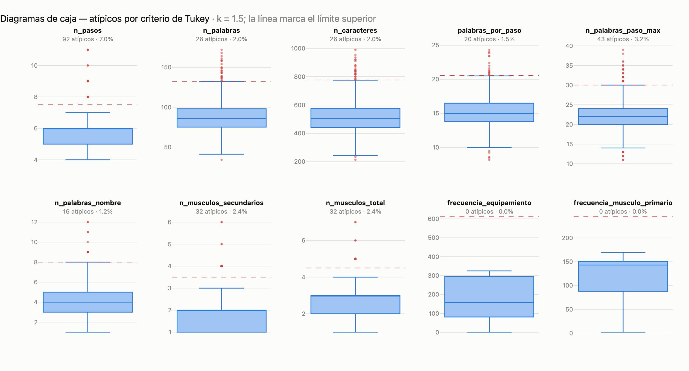
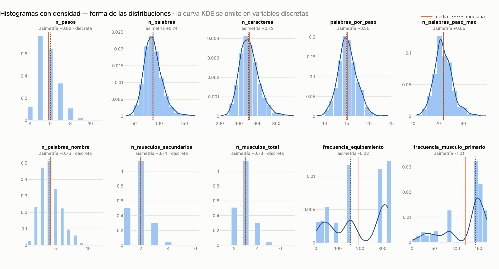
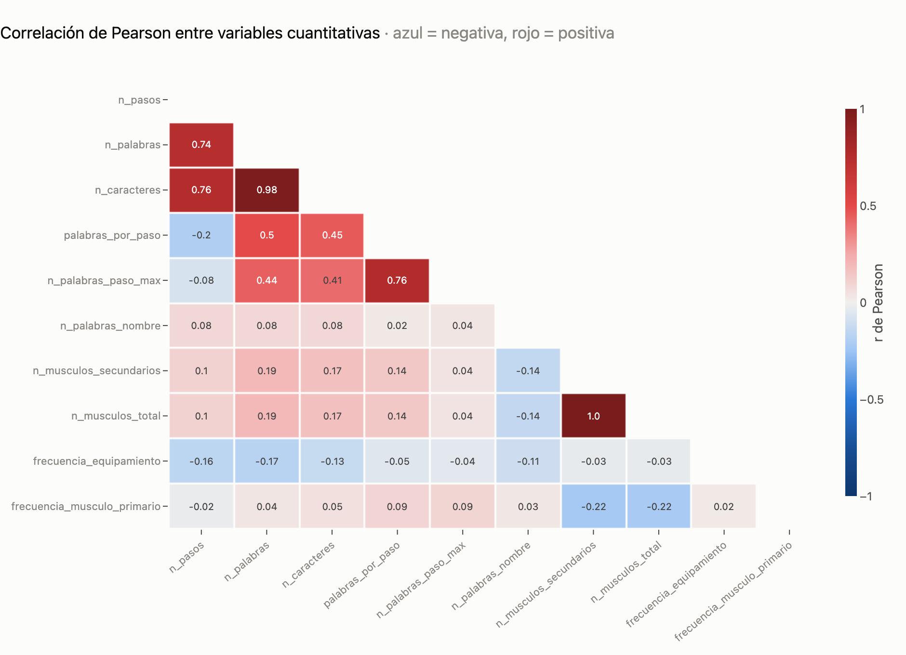
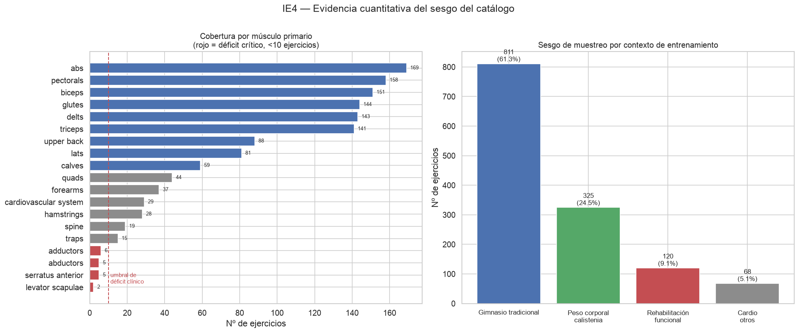

# Sistema de Recomendación Biomecánica — Catálogo de Ejercicios

**Asignatura:** MLY1101 Machine Learning — Duoc UC
**Evaluación:** EV1 — Comprensión del Negocio, Comprensión de los Datos y Preparación
**Metodología:** CRISP-DM (fases 1 a 3)
**Repositorio:** `Unknumb/proyecto_gym`

---

> ### ⚠️ Alcance de esta entrega
> Esta entrega cubre **exclusivamente las fases 1, 2 y 3 de CRISP-DM**. **No se entrena
> ningún modelo predictivo ni de deep learning.** La decisión es deliberada y responde a
> la advertencia metodológica del *"salto al vacío"*: modelar antes de comprender y
> preparar los datos produce sistemas que optimizan métricas sobre supuestos no
> verificados. Las secciones sobre arquitectura de destino (§7) describen el norte
> técnico del proyecto, no trabajo ejecutado en esta evaluación.

---

## 1. Contexto de negocio

### 1.1 El problema

Las aplicaciones de fitness masivas recomiendan ejercicios por **similitud de texto o
por popularidad**, no por mecánica corporal. Esto genera un fallo concreto y frecuente:
un usuario con una limitación articular —tendinitis rotuliana, pinzamiento de hombro,
lumbalgia— recibe como "alternativa" a una sentadilla otro movimiento que carga
exactamente la misma articulación comprometida, porque ambos comparten la etiqueta
*"pierna"*.

### 1.2 La propuesta

Construir un sistema que modele el ejercicio como una **estructura biomecánica** —qué
músculo agonista trabaja, qué sinergistas recluta, qué articulaciones compromete, qué
equipamiento exige— y que permita **enmascarar articulaciones lesionadas** para
encontrar sustitutos mecánicamente equivalentes.

### 1.3 KPIs propuestos

| KPI | Definición | Meta |
|---|---|---|
| Cobertura de sustitución | % de ejercicios con ≥3 alternativas que preservan el músculo objetivo y excluyen la articulación vetada | ≥ 85 % |
| Precisión de la jerarquía muscular | % de registros con agonista y sinergistas correctamente asignados | 100 % (auditado) |
| Cobertura por grupo muscular | Nº mínimo de ejercicios por músculo primario | ≥ 10 (hoy: **4 grupos incumplen**) |
| Latencia de inferencia en dispositivo | FPS de análisis de postura en tiempo real | ≥ 30 FPS |
| Fuga de datos biométricos | Fotogramas de vídeo enviados a servidores externos | **0** (por diseño) |

El tercer KPI **no se cumple con el catálogo actual**. Es un hallazgo del EDA, no un
supuesto: ver §4.1.

---

## 2. IE1 — Fuentes de datos y herramientas

### 2.1 Origen de los datos

| Atributo | Detalle |
|---|---|
| Fuente | Catálogo `exercises.json` (fork de `dataset_ejercicios`) |
| Volumen | **1.324 ejercicios**, 17 MB en JSON crudo |
| Estructura | Semi-estructurada: 15 campos, con diccionarios anidados y listas |
| Recursos visuales | Animaciones cinemáticas (GIF) e imágenes estáticas de **GymVisual**, referenciadas por ruta relativa |
| Idiomas | Instrucciones completas en 10 idiomas: `en`, `es`, `fr`, `hi`, `it`, `ko`, `pl`, `ru`, `tr`, `zh` |
| Licencia de los medios | © GymVisual — uso académico, ver §5.2 |

**Campos de origen:** `id`, `name`, `category`, `body_part`, `equipment`, `target`,
`muscle_group`, `secondary_muscles`, `instructions`, `instruction_steps`, `image`,
`gif_url`, `media_id`, `created_at`, `attribution`.

### 2.2 Stack tecnológico y justificación

| Herramienta | Rol | Por qué |
|---|---|---|
| **Kedro 1.5** | Orquestación de pipelines | Separa la lógica de negocio (nodos puros) del I/O (catálogo declarativo). Los nodos son funciones testeables sin tocar disco, y la arquitectura por capas (`01_raw` → `02_intermediate` → `08_reporting`) hace la trazabilidad explícita. |
| **pandas + NumPy** | Transformación | Operaciones vectorizadas en lugar de bucles fila a fila, requisito para no desbordar memoria al escalar. |
| **Parquet** | Capa intermedia | Formato columnar binario: preserva los `dtypes` (crítico para no corromper la llave `id`) y reduce el footprint frente a CSV/JSON. Ver §3.3. |
| **Seaborn / Matplotlib** | EDA visual | Boxplots, histogramas con KDE y mapas de calor. |
| **Git / GitHub** | Versionamiento | Trabajo en ramas por integrante (`benja`, `feature/data-understanding-pipeline`) con integración revisada. |
| **Databricks Community Edition** | Escalado futuro | Coste cero. Si se requiere cómputo mayor, instancias *Single Node* con auto-terminación a los 15 min de inactividad, bajo el presupuesto FinOps de USD 100. |

---

## 3. IE2 — Preparación de datos

### 3.1 Desanidado de estructuras semi-estructuradas

| Campo de origen | Tipo | Tratamiento |
|---|---|---|
| `instructions` | `dict` de 10 idiomas | Extracción de la clave `es` → `instrucciones_es`; se descartan los 9 idiomas restantes |
| `instruction_steps` | `dict` de 10 listas | Extracción de la lista `es`; se derivan `n_pasos` y `n_palabras_paso_max` |
| `secondary_muscles` | `list` | Dos tratamientos según el grano requerido: `explode()` para la tabla relacional del grafo, y conteo agregado para la tabla analítica |

El pipeline produce **dos tablas con granos distintos**, y la distinción importa:

- **`exercises_clean.parquet`** — grano *ejercicio × músculo secundario* (por el
  `explode`). Base de la futura lista de aristas del grafo biomecánico.
- **`exercise_features.parquet`** — grano *1 fila = 1 ejercicio*. Base del EDA
  cuantitativo. Usar la tabla explotada para estadísticos univariados **inflaría** las
  distribuciones al contar varias veces el mismo ejercicio.

### 3.2 Variables derivadas

Diez variables cuantitativas construidas de forma vectorizada:

`n_pasos` · `n_palabras` · `n_caracteres` · `palabras_por_paso` · `n_palabras_paso_max` ·
`n_palabras_nombre` · `n_musculos_secundarios` · `n_musculos_total` ·
`frecuencia_equipamiento` · `frecuencia_musculo_primario`

### 3.3 Auditoría de calidad y correcciones aplicadas

La primera versión de la preparación se revisó contra los datos crudos. Se detectaron y
corrigieron tres defectos:

**1. Jerarquía muscular invertida (crítico).**
`musculo_primario` se derivaba de `muscle_group`. Se verificó que ese campo está
contenido en `secondary_muscles` en el **100 % de los 1.324 registros**: es un músculo
**sinergista**, no el agonista. El músculo primario real es `target`.

```
¿musculo_primario == muscle_group?  1.0000   ← versión preliminar
¿musculo_primario == target?        0.0015   ← asignación correcta
muscle_group ∈ secondary_muscles:   1324/1324 (100 %)
```

Ejemplo: en `3/4 sit-up` se marcaba *hip flexors* como primario, cuando el objetivo es
**abs** y los flexores de cadera son sinergistas. De haberse mantenido, el grafo
biomecánico habría tenido **invertidas las aristas agonista/sinergista**, y las
sustituciones por lesión habrían sido incorrectas de forma sistemática.

**2. Corrupción de la llave primaria.**
`id` se serializaba a CSV y pandas lo releía como entero: `"0001"` → `1`. Eso rompe el
join con `gif_url` y `media_id` (`videos/0001-2gPfomN.gif`), que es precisamente la
entrada de la fase cinemática. Se fuerza a texto con relleno de ceros y se persiste en
Parquet, que preserva el `dtype`.

**3. Sobreconteo muscular.**
`n_musculos_total` se calculaba como `1 + len(secundarios)`, lo que suma dos veces el
objetivo cuando éste también figura como secundario (2 registros). Ahora se deduplica el
conjunto `{target} ∪ secundarios`.

**Impacto en el footprint.** La versión preliminar en CSV arrastraba los diccionarios de
instrucciones en los 10 idiomas: **16 MB en disco y 17,0 MB en memoria**, de los cuales
15,8 MB eran esas dos columnas. La tabla analítica en Parquet ocupa **260 KB en disco y
1,04 MB en memoria** — una reducción de ~94 %, alineada con la restricción FinOps del
proyecto.

### 3.4 Valores nulos

**No se requirió imputación.** El dataset presenta **0 nulos y 0 duplicados** por `id`
en las 15 columnas de origen. El esquema **no incluye** campos de mecánica
(compuesto/aislado), fuerza (empuje/tracción) ni nivel de dificultad — variables
habituales en catálogos de este tipo. Su ausencia se documenta como limitación (§6); no
se imputan porque **la información no existe en la fuente** y fabricarla introduciría
sesgo sintético en variables clínicamente sensibles.

---

## 4. IE3 — Análisis exploratorio y calidad

Desarrollo completo, celda a celda, en
[`notebooks/01_exploratory_data_analysis.ipynb`](notebooks/01_exploratory_data_analysis.ipynb).

### 4.1 Detección de outliers — Rango Intercuartílico

Criterio de Tukey sobre las diez variables cuantitativas:

$$IQR = Q_3 - Q_1 \qquad \text{L. inferior} = Q_1 - 1.5 \times IQR \qquad \text{L. superior} = Q_3 + 1.5 \times IQR$$

Se eligió el IQR sobre el *z-score* porque es **robusto**: los cuartiles no se ven
arrastrados por los propios valores extremos, y ninguna de estas variables es normal.



**287 valores atípicos** en 8 de 10 variables. `n_pasos` es la más afectada (92 casos,
6,95 %); `frecuencia_equipamiento` y `frecuencia_musculo_primario` no presentan ninguno.

> **Decisión: no se elimina ningún registro.** Los atípicos son *valores extremos
> legítimos* —ejercicios compuestos y movimientos olímpicos que genuinamente requieren
> más pasos y reclutan más músculos—, no errores de medición. Como no hay nulos ni
> duplicados, el IQR opera aquí como **instrumento de caracterización**, no de limpieza.
> Descartarlos sesgaría el catálogo hacia ejercicios simples, que es justamente el sesgo
> denunciado en §5.1.

### 4.2 Análisis de forma — histogramas con KDE



**Sesgo positivo generalizado.** Siete de diez variables presentan asimetría positiva
moderada (+0,55 a +0,83), con media > mediana en todas. El catálogo se compone
mayoritariamente de **ejercicios simples y cortos**, con una cola derecha de movimientos
complejos. La moda de `n_pasos` es 6 y la de `n_musculos_total` es 3.

**La excepción diagnóstica:** `frecuencia_musculo_primario` es la única con **sesgo
negativo fuerte (−1,01)** y curtosis negativa (−0,43). La mayoría de los ejercicios
apuntan a músculos muy cubiertos, con una cola izquierda delgada de músculos casi
huérfanos. Esta asimetría **es la firma estadística del sesgo de muestreo** analizado
en §5.1.

### 4.3 Matriz de correlación de Pearson



**Redundancia crítica (|r| > 0,9):**

| Par | *r* | Acción |
|---|---|---|
| `n_musculos_secundarios` ↔ `n_musculos_total` | 0,999 | Conservar solo `n_musculos_total` |
| `n_palabras` ↔ `n_caracteres` | 0,981 | Conservar `n_palabras` |

**Hallazgos informativos:**

- `n_pasos` ↔ `palabras_por_paso` = **−0,20**. Correlación negativa: al descomponer un
  ejercicio en más pasos, cada paso se vuelve más breve. El catálogo mantiene
  aproximadamente constante el esfuerzo cognitivo por paso — un patrón de diseño
  editorial, no un accidente.
- `n_musculos_total` ↔ `n_pasos` = **0,10**. La complejidad biomecánica y la textual son
  **ejes independientes**: la extensión de la instrucción no predice la exigencia del
  movimiento. Ambas aportan señal no redundante al futuro modelo.

---

## 5. IE4 — Evaluación ética, sesgos y privacidad

### 5.1 Sesgo de muestreo



El catálogo **no es una muestra representativa del ejercicio físico**: es un inventario
de gimnasio comercial orientado a hipertrofia. La evidencia es cuantitativa, medida con
el coeficiente de Gini sobre las distribuciones de frecuencia (0 = cobertura uniforme,
1 = concentración total):

| Medición | Valor | Lectura |
|---|---|---|
| Gini de equipamiento | **0,737** | Concentración alta |
| Gini de músculo primario | **0,478** | Concentración moderada |
| Top-3 equipamientos | **58,6 %** del catálogo | *body weight*, *dumbbell*, *cable* |
| Categorías con <10 ejercicios | 13 de 28 | Suman solo 30 ejercicios (2,3 %) |

**Cobertura por contexto de entrenamiento:**

| Contexto | Ejercicios | % |
|---|---|---|
| Gimnasio tradicional (peso libre y máquinas) | 811 | **61,3 %** |
| Peso corporal / calistenia | 325 | 24,5 % |
| Rehabilitación / funcional (bandas, balón, asistido) | 120 | **9,1 %** |
| Cardio / otros | 68 | 5,1 % |

**Cuatro consecuencias éticas concretas:**

1. **Exclusión por acceso material.** El 61,3 % del catálogo exige equipamiento de
   gimnasio. Un usuario sin acceso —por coste, ubicación o movilidad— recibe
   recomendaciones sistemáticamente inaplicables. El sesgo no es neutral: correlaciona
   con nivel socioeconómico.

2. **Déficit de rehabilitación y tercera edad.** Solo el 9,1 % del catálogo emplea
   material funcional o asistido. Las poblaciones que **más se beneficiarían** de una
   guía biomecánica —personas en recuperación post-lesión, adultos mayores— son las peor
   cubiertas.

3. **Músculos huérfanos con relevancia clínica.** Cuatro grupos musculares tienen menos
   de 10 ejercicios: `levator scapulae` (2), `abductors` (5), `serratus anterior` (5) y
   `adductors` (6). Abductores y aductores son centrales en la **estabilidad de cadera**
   y en la prevención de lesiones de rodilla. La funcionalidad de sustitución por lesión
   —el núcleo de la propuesta— tendría hoy un espacio de búsqueda casi vacío para esas
   articulaciones.

4. **Desbalance agonista/antagonista.** `quads` (44 ejercicios) frente a `hamstrings`
   (28), ratio 1,6:1. Un plan generado sin corregir esta proporción **reforzaría** el
   desbalance cuádriceps-isquiotibiales, un factor de riesgo documentado en lesiones de
   ligamento cruzado anterior. El sistema podría aumentar el riesgo que dice mitigar.

**Mitigación adoptada.** El sesgo **no se corrige eliminando filas** —eso reduciría aún
más la cobertura—, sino mediante tres medidas: (a) declararlo explícitamente en este
documento y en la ficha del modelo; (b) imponer en la capa de recomendación una **cuota
mínima de alternativas sin equipamiento**, de modo que el ranking no colapse hacia el
gimnasio; y (c) **rechazar explícitamente** la recomendación cuando el músculo objetivo
esté por debajo del umbral de 10 ejercicios, devolviendo una advertencia de cobertura
insuficiente en lugar de una sugerencia poco fundamentada.

### 5.2 Propiedad intelectual — GymVisual

Los recursos visuales (GIF animados e imágenes) son **propiedad de GymVisual**, según
consta en el campo `attribution` de los 1.324 registros
(`© Gym visual — https://gymvisual.com/`).

**Marco de uso adoptado:**

- **Uso académico sin fines comerciales.** El proyecto se desarrolla en el contexto de
  la asignatura MLY1101. No hay explotación comercial, monetización ni distribución
  pública de los medios.
- **Atribución preservada.** El campo `attribution` se conserva íntegro en todas las
  capas del pipeline. No se elimina ni se ofusca la autoría en ningún punto de la
  transformación.
- **Desacople estructural entre datos y renderizados.** Ésta es la decisión de diseño
  clave. El sistema **no redistribuye los archivos de GymVisual**: el pipeline consume
  los GIF únicamente como *señal de entrada* para extraer coordenadas articulares, y lo
  que persiste es la **representación numérica derivada** (secuencias de puntos
  corporales), no el material audiovisual. La aplicación final desacopla la capa de
  datos de la capa de renderizado, de modo que una versión distribuible pueda operar con
  animaciones propias o con licencia distinta.
- **Límite reconocido.** El *fair use* académico **no habilita** la publicación del
  dataset con los medios incluidos ni un despliegue comercial. Cualquier paso en esa
  dirección exige una licencia comercial con GymVisual. Se documenta aquí para que la
  restricción sea explícita y no se descubra tarde.

### 5.3 Responsabilidad algorítmica y seguridad

> **⚕️ Exención de responsabilidad médica.** Este sistema es una herramienta informativa
> y educativa. **No constituye diagnóstico, prescripción ni tratamiento médico**, y no
> sustituye la evaluación de un profesional de la salud —médico, kinesiólogo o
> fisioterapeuta—. Las recomendaciones se derivan de un catálogo de ejercicios de
> propósito general, sin conocimiento del historial clínico, las patologías previas ni
> las contraindicaciones del usuario. Ante dolor, lesión activa o condición médica
> diagnosticada, consulte a un profesional antes de iniciar cualquier rutina.

**Reglas de seguridad de diseño:**

| Regla | Implementación |
|---|---|
| No prescribir sobre articulación comprometida | Enmascarado obligatorio de la articulación declarada; el ejercicio se excluye del espacio de búsqueda, no se pondera a la baja |
| Abstención ante cobertura insuficiente | Si el músculo objetivo tiene <10 ejercicios, se devuelve advertencia explícita en lugar de recomendación |
| No inferir capacidad clínica | El catálogo carece de nivel de dificultad y contraindicaciones; el sistema **no estima** esas variables ausentes |
| Trazabilidad de la recomendación | Toda sugerencia expone su justificación (músculo objetivo preservado, articulación excluida), de modo que sea auditable por el usuario o su terapeuta |
| Sin retroalimentación correctiva en tiempo real | El análisis de postura reporta desviaciones angulares como *observación*, nunca como corrección imperativa que el usuario deba ejecutar bajo carga |

**Limitación asumida:** el sistema puede fallar por omisión —no recomendar algo útil— o
por cobertura —no encontrar sustituto—. Se diseña para que **falle hacia la abstención**,
no hacia la sugerencia infundada. En un dominio donde el error se paga con una lesión,
el silencio es preferible a la confianza injustificada.

### 5.4 Privacidad radical mediante Edge AI

El componente de análisis de movimiento procesa **vídeo de la cámara del usuario**: el
dato más sensible de todo el sistema. La decisión arquitectónica es procesarlo
**íntegramente en el dispositivo**.

**Arquitectura:** conversión de los modelos a formato Core ML con cuantización FP16/INT8,
e inferencia local sobre el Apple Neural Engine mediante el framework Vision. El vídeo
**nunca abandona el teléfono**: no se transmite, no se almacena en servidores, no se
usa para reentrenar. Lo que persiste localmente son métricas agregadas —ángulos
articulares, conteo de repeticiones—, no fotogramas.

**Cumplimiento normativo:**

- **Ley N° 19.628 (Chile), sobre protección de la vida privada.** Marco vigente para el
  tratamiento de datos personales. Al no existir transmisión ni almacenamiento remoto,
  no hay banco de datos personales bajo control del responsable: el riesgo se elimina
  en origen, no se gestiona con controles de acceso.
- **Ley N° 21.719 (Chile).** Nueva normativa de protección de datos personales que
  sustituye el marco anterior, crea la Agencia de Protección de Datos Personales y
  clasifica los **datos biométricos como datos sensibles**, sujetos a consentimiento
  expreso y a un régimen sancionatorio reforzado. El diseño *on-device* anticipa este
  estándar. *(Verificar la fecha exacta de entrada en vigencia al momento de la defensa.)*
- **RGPD (UE).** Bajo el Art. 4(14), la calificación como *dato biométrico* exige que el
  tratamiento persiga la **identificación unívoca** de la persona. La estimación de
  pose para evaluar técnica deportiva **no persigue identificar** al usuario, por lo que
  no activa por sí sola el régimen del Art. 9. No obstante, el vídeo de una persona
  identificable **sí es dato personal**, y el proyecto adopta el estándar más exigente
  por precaución.
- **Principios aplicados:** *privacy by design* y *privacy by default* (Art. 25 RGPD) —
  la configuración más protectora es la única disponible, no una opción a activar— y
  **minimización de datos** (Art. 5.1.c): solo se derivan las coordenadas articulares
  necesarias, descartando el fotograma inmediatamente después de procesarlo.

**Beneficio colateral:** el procesamiento local elimina el consumo de datos móviles y
la latencia de red, habilitando análisis a 30+ FPS sin conectividad. La decisión ética
y la técnica coinciden.

---

## 6. Limitaciones reconocidas

1. **Ausencia de variables de estratificación.** El esquema carece de nivel de
   dificultad, mecánica (compuesto/aislado), tipo de fuerza (empuje/tracción) y
   contraindicaciones. Sin ellas es imposible auditar el sesgo por nivel del usuario.
2. **Articulaciones no modeladas explícitamente.** El catálogo describe músculos, no
   articulaciones. El mapeo músculo → articulación comprometida requiere una **fuente
   externa validada clínicamente**, aún no incorporada. Es el prerrequisito del grafo
   biomecánico.
3. **Medios no disponibles localmente.** Los GIF se referencian por ruta relativa
   (`videos/0001-2gPfomN.gif`) pero **no están en el repositorio**. La extracción
   cinemática requiere obtenerlos primero.
4. **Sin validación clínica.** Ninguna de las asignaciones musculares del catálogo ha
   sido verificada por un profesional del área. Se asume la fuente como correcta.
5. **Sesgo lingüístico.** Se conserva únicamente el español; el análisis textual no es
   extrapolable a los otros nueve idiomas.

---

## 7. Arquitectura de destino (fuera del alcance de EV1)

Norte técnico del proyecto, **no implementado en esta entrega**:

1. **Grafo de conocimiento biomecánico** — nodos de tipo Ejercicio, Músculo Primario,
   Músculo Sinergista, Articulación y Equipamiento; ruteo topológico por vecindad
   (Node2Vec / GCN) para hallar sustitutos enmascarando articulaciones lesionadas.
2. **Análisis temporal de movimiento** — extracción de 33 puntos corporales 3D desde los
   GIF, secuencias `(T, 33×3)`, y modelo secuencial sobre variaciones angulares para
   clasificar fases del movimiento (excéntrica, concéntrica, isométrica).
3. **Despliegue Edge AI** — cuantización a Core ML e inferencia en el Apple Neural
   Engine (§5.4).

---

## 8. Reproducibilidad

### 8.1 Instalación

```bash
python -m venv .venv
source .venv/bin/activate
pip install -r requirements.txt
```

### 8.2 Ejecución del pipeline

```bash
kedro run                              # pipeline completo (8 nodos)
kedro run --pipeline=data_understanding
```

### 8.3 Notebook de EDA

```bash
jupyter lab notebooks/01_exploratory_data_analysis.ipynb
```

El notebook está versionado **con todas las salidas ejecutadas y visibles**. Se ejecuta
de principio a fin sin errores en orden secuencial (celdas 1 a 21).

### 8.4 Estructura del repositorio

```
proyecto_ejercicios/
├── conf/base/
│   ├── catalog.yml                  # Definición declarativa de los datasets
│   └── parameters.yml
├── data/
│   ├── 01_raw/exercises.json        # Fuente inmutable (17 MB)
│   ├── 02_intermediate/
│   │   ├── exercises_clean.parquet  # Grano ejercicio × músculo secundario
│   │   └── exercise_features.parquet# Grano ejercicio (tabla analítica)
│   └── 08_reporting/
│       ├── eda_summary.csv
│       ├── distribution_metrics.csv
│       ├── outliers_iqr.csv
│       ├── shape_statistics.csv
│       ├── correlation_matrix.csv
│       └── figures/                 # Gráficos exportados del EDA
├── notebooks/
│   └── 01_exploratory_data_analysis.ipynb
├── src/gym_exercises/
│   ├── pipeline_registry.py
│   └── pipelines/data_understanding/
│       ├── nodes.py                 # 8 nodos puros y testeables
│       └── pipeline.py              # Definición del DAG
├── requirements.txt
└── README.md
```

### 8.5 Nodos del pipeline

| Nodo | Entrada | Salida |
|---|---|---|
| `audit_dataset_structure` | `raw_exercises_data` | `audit_report` (memoria) |
| `flatten_exercise_metadata` | `raw_exercises_data` | `intermediate_exercises_clean` |
| `compute_distribution_metrics` | `intermediate_exercises_clean` | `distribution_metrics` |
| `save_eda_summary` | `audit_report`, `distribution_metrics` | `eda_summary_report` |
| `build_exercise_features` | `raw_exercises_data` | `intermediate_exercise_features` |
| `detect_outliers_iqr` | `intermediate_exercise_features` | `outliers_iqr_report` |
| `compute_shape_statistics` | `intermediate_exercise_features` | `shape_statistics_report` |
| `compute_correlation_matrix` | `intermediate_exercise_features` | `correlation_matrix_report` |

---

## 9. Síntesis de hallazgos

| Dimensión | Resultado |
|---|---|
| **Calidad estructural** | Excelente: 1.324 registros, 0 nulos, 0 duplicados, esquema consistente |
| **Corrección aplicada** | Jerarquía muscular invertida en el 100 % de los registros — detectada y corregida |
| **Outliers (IQR)** | 287 en 8 de 10 variables; **ninguno eliminado** (extremos legítimos) |
| **Forma de las distribuciones** | Sesgo positivo moderado en 7 de 10 variables |
| **Multicolinealidad** | 2 pares redundantes (*r* = 0,999 y 0,981) marcados para depuración |
| **Riesgo ético principal** | Gini de equipamiento 0,737; 4 grupos musculares bajo el umbral de cobertura |
| **Estado CRISP-DM** | Fases 1–3 cerradas. **Sin modelado predictivo**, conforme al alcance de EV1 |
