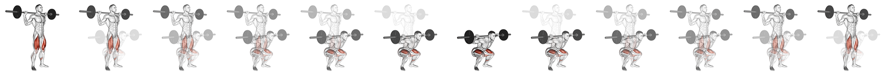
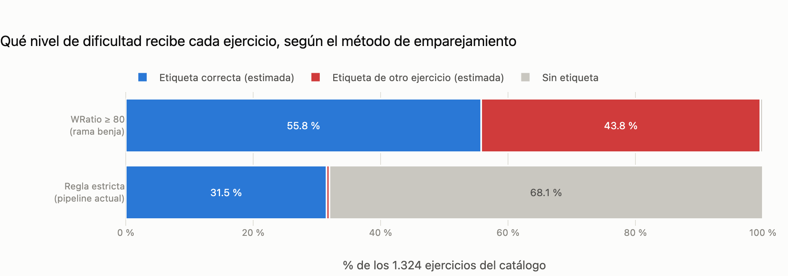
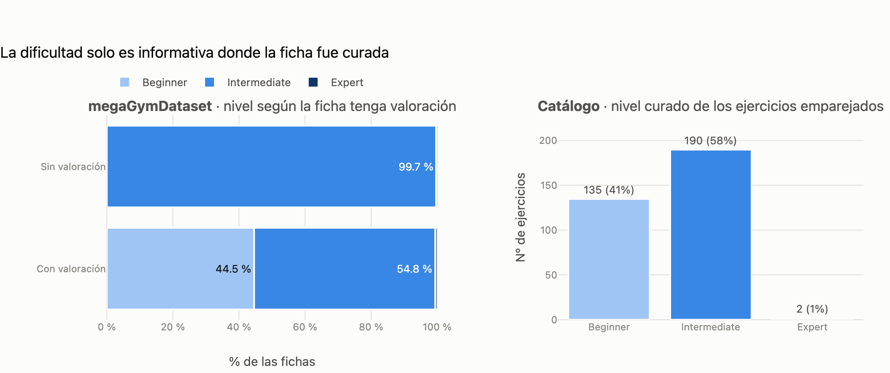
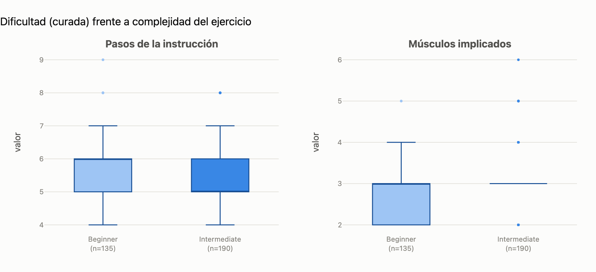
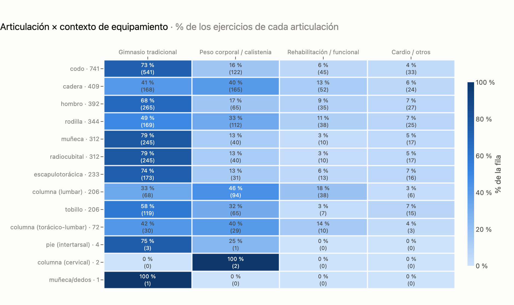
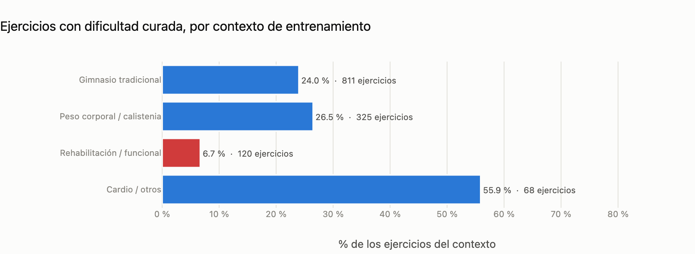

# Sistema de Recomendación Biomecánica — Catálogo de Ejercicios

**Asignatura:** MLY1101 Machine Learning — Duoc UC
**Evaluación:** EV1 — Comprensión del Negocio, Comprensión de los Datos y Preparación
**Metodología:** CRISP-DM (fases 1 a 3)
**Repositorio:** `Unknumb/proyecto_gym`

---

> ### ⚠️ Alcance de esta entrega
> Esta entrega cubre **exclusivamente las fases 1, 2 y 3 de CRISP-DM**. **No se entrena
> ningún modelo predictivo ni de deep learning.** La decisión es deliberada y responde a
> la advertencia metodológica del *"salto al vacío"*: modelar antes de comprender y
> preparar los datos produce sistemas que optimizan métricas sobre supuestos no
> verificados. Las secciones sobre arquitectura de destino (§7) describen el norte
> técnico del proyecto, no trabajo ejecutado en esta evaluación.

---

## 1. Contexto de negocio

### 1.1 El problema

Las aplicaciones de fitness masivas recomiendan ejercicios por **similitud de texto o
por popularidad**, no por mecánica corporal. Esto genera un fallo concreto y frecuente:
un usuario con una limitación articular —tendinitis rotuliana, pinzamiento de hombro,
lumbalgia— recibe como "alternativa" a una sentadilla otro movimiento que carga
exactamente la misma articulación comprometida, porque ambos comparten la etiqueta
*"pierna"*.

### 1.2 La propuesta

Construir un sistema que modele el ejercicio como una **estructura biomecánica** —qué
músculo agonista trabaja, qué sinergistas recluta, qué articulaciones compromete, qué
equipamiento exige— y que permita **enmascarar articulaciones lesionadas** para
encontrar sustitutos mecánicamente equivalentes.

### 1.3 KPIs propuestos

| KPI | Definición | Meta |
|---|---|---|
| Cobertura de sustitución | % de ejercicios con ≥3 alternativas que preservan el músculo objetivo y excluyen la articulación vetada | ≥ 85 % |
| Precisión de la jerarquía muscular | % de registros con agonista y sinergistas correctamente asignados | 100 % (auditado) |
| Cobertura por grupo muscular | Nº mínimo de ejercicios por músculo primario | ≥ 10 (hoy: **4 grupos incumplen**) |
| Latencia de inferencia en dispositivo | FPS de análisis de postura en tiempo real | ≥ 30 FPS |
| Fuga de datos biométricos | Fotogramas de vídeo enviados a servidores externos | **0** (por diseño) |

El tercer KPI **no se cumple con el catálogo actual**. Es un hallazgo del EDA, no un
supuesto: ver §4.1.

---

## 2. IE1 — Fuentes de datos y herramientas

### 2.1 Origen de los datos

La entrega combina **tres fuentes**. El catálogo base es el esqueleto; las otras dos
aportan variables que su esquema no trae.

| # | Fuente | Aporta | Cómo se une | Licencia |
|---|---|---|---|---|
| 1 | Catálogo `exercises.json` | 1.324 ejercicios: músculos, equipamiento, instrucciones | — | MIT |
| 2 | **megaGymDataset** (Kaggle) | Nivel de dificultad, tipo, valoración | Por nombre, emparejamiento difuso auditado (§3.5) | CC0 |
| 3 | **Mapeo músculo → articulación** (curado) | Articulación(es) de cada músculo | Por músculo (§6.2) | Wikipedia CC BY-SA; ExRx.net citado, sin copia |

**Fuente 1 — Catálogo base**

| Atributo | Detalle |
|---|---|
| Fuente | Catálogo `exercises.json` (fork de `dataset_ejercicios`) |
| Volumen | **1.324 ejercicios**, 17 MB en JSON crudo |
| Estructura | Semi-estructurada: 15 campos, con diccionarios anidados y listas |
| Recursos visuales | Animaciones cinemáticas (GIF) e imágenes estáticas de **GymVisual**, referenciadas por ruta relativa |
| Idiomas | Instrucciones completas en 10 idiomas: `en`, `es`, `fr`, `hi`, `it`, `ko`, `pl`, `ru`, `tr`, `zh` |
| Licencia de los datos | **MIT** (© 2026 Hasan Emir Yıldırım) — uso, modificación y distribución libres |
| Licencia de los medios | Propiedad de **Gym visual**, permiso escrito de redistribución a 180×180 con atribución — ver §5.2 |

**Campos de origen:** `id`, `name`, `category`, `body_part`, `equipment`, `target`,
`muscle_group`, `secondary_muscles`, `instructions`, `instruction_steps`, `image`,
`gif_url`, `media_id`, `created_at`, `attribution`.

**Fuente 2 — megaGymDataset**

| Atributo | Detalle |
|---|---|
| Origen | Kaggle, [`niharika41298/gym-exercise-data`](https://www.kaggle.com/datasets/niharika41298/gym-exercise-data) — *Gym Exercise Dataset*, Niharika Pandit |
| Versión | 1 (publicada el 2022-12-30; es la única versión, así que el contenido queda fijado aunque no conste la fecha exacta de descarga) |
| Volumen | **2.918 filas × 9 columnas** (`Title`, `Desc`, `Type`, `BodyPart`, `Equipment`, `Level`, `Rating`, `RatingDesc` + índice) |
| Integridad del archivo | Kaggle declara 673.158 bytes; el versionado pesa 670.239. La diferencia coincide exactamente con sus 2.919 saltos de línea, consistente con una conversión CRLF → LF, no con filas perdidas |
| Licencia | **CC0: Public Domain**, verificada en la API de Kaggle el 2026-09-13. Matiz de propiedad intelectual en §5.2 |
| Incorporación | Rama `benja` (commit `e074742`), portado a `data/01_raw/megaGymDataset.csv` |
| Calidad | 7 títulos repetidos; `Rating` nulo en el 64,7 % y `0.0` como marcador de "sin valoración" en otras 244 filas; `Desc` nula en el 53 % |

**Fuente 3 — Mapeo músculo → articulación.** Tabla curada en
`data/01_raw/musculo_articulacion_manual.csv` por
`scripts/construir_mapeo_articulaciones.py`: 40 de los 50 músculos del catálogo con
articulación confirmada y fuente citada por fila. Metodología y límites en §6.2.

### 2.2 Stack tecnológico y justificación

| Herramienta | Rol | Por qué |
|---|---|---|
| **Kedro 1.5** | Orquestación de pipelines | Separa la lógica de negocio (nodos puros) del I/O (catálogo declarativo). Los nodos son funciones testeables sin tocar disco, y la arquitectura por capas (`01_raw` → `02_intermediate` → `08_reporting`) hace la trazabilidad explícita. |
| **pandas + NumPy** | Transformación | Operaciones vectorizadas en lugar de bucles fila a fila, requisito para no desbordar memoria al escalar. |
| **Parquet** | Capa intermedia | Formato columnar binario: preserva los `dtypes` (crítico para no corromper la llave `id`) y reduce el footprint frente a CSV/JSON. Ver §3.3. |
| **rapidfuzz** | Emparejamiento por nombre | Similitud de cadenas vectorizada (`process.cdist`) para unir megaGymDataset sin llave común: 1.324 × 2.590 comparaciones en menos de un segundo. §3.5 |
| **Plotly** | EDA visual | Gráficos interactivos con capa de *hover*: el lector inspecciona cada valor sin depender de etiquetas impresas. `kaleido` exporta además la versión estática en PNG para este informe. |
| **Git / GitHub** | Versionamiento | Trabajo en ramas por integrante (`benja`, `feature/data-understanding-pipeline`) con integración revisada. |
| **Databricks + Delta Lake** | Gobierno del dato y escalamiento | *Schema enforcement*, transacciones ACID y *time travel* sobre la arquitectura medallion. Justificación detallada y control de costes en §2.3. |

### 2.3 Databricks: dónde encaja y dónde no

Databricks forma parte del ecosistema tecnológico del proyecto, por lo que corresponde
justificar su rol con honestidad en lugar de invocarlo como credencial.

**El argumento de volumen no aplica, y conviene decirlo.** La tabla analítica ocupa
**260 KB en disco y 1,04 MB en memoria**; el JSON crudo completo son 16,6 MB. La
partición por defecto de Spark es de 128 MB: el dataset entero cabe en el **0,2 % de una
sola partición**. Spark lo procesaría en una única tarea, pagando íntegro el coste de
arranque de la JVM y de planificación distribuida sin ningún paralelismo que compense.
En esta escala, pandas es más rápido —y sostener lo contrario en la defensa sería
indefendible frente a la primera pregunta sobre el tamaño del dato.

**Los argumentos que sí sostienen su adopción son tres, y ninguno es de rendimiento:**

**1. Delta Lake como capa de gobierno, no de velocidad.** El defecto más grave que
encontró esta entrega —el `id` corrompiéndose de `"0001"` a `1` en la carga, §3.3— es
exactamente el tipo de error que el *schema enforcement* de Delta detiene en la
escritura: una tabla Delta con `id STRING` habría rechazado el `long` inferido en lugar
de propagarlo silenciosamente por todo el pipeline. A eso se suman transacciones ACID y
*time travel*, que permiten reproducir el estado exacto de una capa en una fecha dada.
Para un proyecto con implicancias clínicas, poder auditar **qué datos produjeron qué
recomendación** no es opcional.

Esto no queda como afirmación: la sección 6 del notebook
`notebooks/databricks/01_bronze_ingesta_delta.py` **falla a propósito**. Intenta anexar a
la tabla bronze el mismo `id` que Spark infiere como `bigint` y Delta rechaza la
escritura por incompatibilidad de tipos. El defecto que en pandas se propagó en silencio
hasta la capa de reporting, en Delta muere en el `write`.

**2. La arquitectura medallion ya está implementada.** Las capas de Kedro
(`01_raw` → `02_intermediate` → `08_reporting`) son literalmente bronze → silver → gold.
Migrar consiste en apuntar el catálogo a tablas Delta; los nodos son funciones puras
sobre DataFrames y no cambian. La migración está implementada en `conf/databricks/`
y se activa con `kedro run --env=databricks`:

```yaml
intermediate_exercise_features:
  type: databricks.ManagedTableDataset
  catalog: workspace
  database: gym_silver
  table: exercise_features
  dataframe_type: pandas      # la conversión ocurre en el borde de I/O
  write_mode: overwrite
```

`dataframe_type: pandas` es lo que hace literal la afirmación anterior: `nodes.py` sigue
recibiendo y devolviendo DataFrames de pandas, y la conversión desde/hacia Delta ocurre
en el dataset. Nótese que no aparece ninguna ruta `dbfs:/`: el cómputo serverless no
expone DBFS y los archivos crudos viven en un **volumen de Unity Catalog**
(`/Volumes/workspace/gym_bronze/raw/`), que además queda gobernado por los mismos
permisos que las tablas.

**3. Es la ruta de escalamiento del único trabajo que sí es masivo.** El procesamiento
de medios —1.324 animaciones × 12 a 47 fotogramas, del orden de 25.000 imágenes— es
*embarrassingly parallel* y sí justifica cómputo distribuido. Es el punto en que
Databricks deja de ser una decisión de forma y pasa a ser necesario. Conviene señalar
que, por lo documentado en §4.4, ese procesamiento **no se ejecutará sobre este corpus**;
la ruta queda descrita para cuando exista material apto.

**Control de costes (FinOps).** El presupuesto del proyecto es de USD 100 y el gasto
efectivo es **cero**, porque el entorno en uso es **Databricks Free Edition** —el
reemplazo de la antigua Community Edition, retirada en 2025—. Conviene ser preciso sobre
qué implica esa elección, porque determina qué controles de coste existen y cuáles
simplemente no aplican:

| Medida efectiva | Cómo opera en Free Edition |
|---|---|
| Entorno de trabajo | **Free Edition**, sin tarjeta de crédito y sin consumo facturable. Uso no comercial, que es el caso de esta asignatura. |
| Cómputo | **Serverless exclusivamente.** No se aprovisionan clústeres: no hay tamaño, ni tipo de instancia, ni auto-terminación que configurar, porque no hay recurso encendido entre sesiones. |
| Almacenamiento | *Default storage* de la cuenta, bajo Unity Catalog. Sin buckets propios que administrar ni cobrar. |
| Techo de gasto | Estructural, no configurado: la plataforma aplica cuotas de uso y suspende el cómputo al excederlas. No existe factura que limitar. |
| Aislamiento | Un workspace y un metastore por cuenta, sin consola de cuenta. Cada integrante trabaja en el suyo y la colaboración ocurre en Git, no dentro del workspace. |

**Sobre lo que aquí no se controla, y por qué.** Los controles habituales de un workspace
de pago —clúster *Single Node*, auto-terminación a 15 minutos, instancias *spot*,
*budget alert* en la nube— **no tienen dónde configurarse en Free Edition**: presuponen
un plano de cómputo propio y una consola de cuenta que esta edición no expone.
Enumerarlos como si estuvieran aplicados sería describir un entorno distinto del que el
equipo usa. Quedan, entonces, como el plan para el único escenario que los requeriría —el
procesamiento distribuido de medios del punto 3, sobre un workspace de pago—:

| Medida | Configuración prevista al migrar a workspace de pago |
|---|---|
| Cómputo | Clúster **Single Node**, el mínimo que ejecuta Spark, o *job compute* efímero |
| Auto-terminación | **15 minutos** de inactividad, sin excepción |
| Instancias | *Spot* con reversión a bajo demanda |
| Alerta de gasto | *Budget alert* al 50 % del crédito |
| Regla operativa | Ningún clúster queda encendido fuera de una sesión de trabajo activa |

**Límite conocido del entorno.** El cómputo serverless restringe la red saliente a un
conjunto de dominios de confianza. Por eso `scripts/auditar_media_fisica.py` —la única
pieza del proyecto que descarga recursos externos (§4.4)— se ejecuta localmente y no en
el workspace. La restricción es coherente con el diseño: el pipeline y el notebook de EDA
son reproducibles sin red.

**Puesta en marcha.** El procedimiento operativo completo —crear la cuenta, clonar el
repositorio como *Git folder*, ejecutar los notebooks y leer las tablas resultantes— está
en [`docs/databricks_setup.md`](docs/databricks_setup.md).

> **Postura del equipo.** Se adopta Databricks por gobierno del dato y por ser la ruta de
> escalamiento del procesamiento de medios, **no por volumen**. Documentar que en esta
> escala Spark sería contraproducente es parte del criterio de ingeniería que la
> asignatura evalúa: saber cuándo *no* usar una herramienta es tan relevante como saber
> operarla.

---

## 3. IE2 — Preparación de datos

### 3.1 Desanidado de estructuras semi-estructuradas

| Campo de origen | Tipo | Tratamiento |
|---|---|---|
| `instructions` | `dict` de 10 idiomas | Extracción de la clave `es` → `instrucciones_es`; se descartan los 9 idiomas restantes |
| `instruction_steps` | `dict` de 10 listas | Extracción de la lista `es`; se derivan `n_pasos` y `n_palabras_paso_max` |
| `secondary_muscles` | `list` | Dos tratamientos según el grano requerido: `explode()` para la tabla relacional del grafo, y conteo agregado para la tabla analítica |

El pipeline produce **dos tablas con granos distintos**, y la distinción importa:

- **`exercises_clean.parquet`** — grano *ejercicio × músculo secundario* (por el
  `explode`). Base de la futura lista de aristas del grafo biomecánico.
- **`exercise_features.parquet`** — grano *1 fila = 1 ejercicio*. Base del EDA
  cuantitativo. Usar la tabla explotada para estadísticos univariados **inflaría** las
  distribuciones al contar varias veces el mismo ejercicio.

### 3.2 Variables derivadas

Diez variables cuantitativas construidas de forma vectorizada:

`n_pasos` · `n_palabras` · `n_caracteres` · `palabras_por_paso` · `n_palabras_paso_max` ·
`n_palabras_nombre` · `n_musculos_secundarios` · `n_musculos_total` ·
`frecuencia_equipamiento` · `frecuencia_musculo_primario`

### 3.3 Auditoría de calidad y correcciones aplicadas

La primera versión de la preparación se revisó contra los datos crudos. Se detectaron y
corrigieron tres defectos:

**1. Jerarquía muscular invertida (crítico).**
`musculo_primario` se derivaba de `muscle_group`. Se verificó que ese campo está
contenido en `secondary_muscles` en el **100 % de los 1.324 registros**: es un músculo
**sinergista**, no el agonista. El músculo primario real es `target`.

```
¿musculo_primario == muscle_group?  1.0000   ← versión preliminar
¿musculo_primario == target?        0.0015   ← asignación correcta
muscle_group ∈ secondary_muscles:   1324/1324 (100 %)
```

Ejemplo: en `3/4 sit-up` se marcaba *hip flexors* como primario, cuando el objetivo es
**abs** y los flexores de cadera son sinergistas. De haberse mantenido, el grafo
biomecánico habría tenido **invertidas las aristas agonista/sinergista**, y las
sustituciones por lesión habrían sido incorrectas de forma sistemática.

**2. Corrupción de la llave primaria — en la carga, no solo al serializar.**
`id` se releía como entero y perdía los ceros a la izquierda: `"0001"` → `1`. Eso rompe
el join con `gif_url` y `media_id` (`videos/0001-2gPfomN.gif`), que es precisamente la
entrada de la fase cinemática.

El diagnóstico inicial atribuyó la pérdida a la serialización a CSV. Al construir la
auditoría de medios (§4.4) quedó claro que el problema es **anterior**: `pandas.read_json`
infiere el tipo y corrompe la llave **en el momento de la carga**, antes de cualquier
transformación. Con el `id` corrupto, solo el 46,8 % de los registros reconstruía
correctamente su ruta de medios.

Se corrige por tanto **en el origen**, declarando el tipo en el catálogo:

```yaml
raw_exercises_data:
  type: pandas.JSONDataset
  filepath: data/01_raw/exercises.json
  load_args:
    dtype: {id: str, media_id: str}
```

Con la llave declarada como texto, la conformidad sube al **100 %**. La capa intermedia
se persiste además en Parquet, que preserva los `dtypes` y evita que el problema
reaparezca al reescribir.

**3. Sobreconteo muscular.**
`n_musculos_total` se calculaba como `1 + len(secundarios)`, lo que suma dos veces el
objetivo cuando éste también figura como secundario (2 registros). Ahora se deduplica el
conjunto `{target} ∪ secundarios`.

**Impacto en el footprint.** La versión preliminar en CSV arrastraba los diccionarios de
instrucciones en los 10 idiomas: **16 MB en disco y 17,0 MB en memoria**, de los cuales
15,8 MB eran esas dos columnas. La tabla analítica en Parquet ocupa **260 KB en disco y
1,04 MB en memoria** — una reducción de ~94 %, alineada con la restricción FinOps del
proyecto.

### 3.4 Valores nulos

**No se requirió imputación.** El dataset presenta **0 nulos y 0 duplicados** por `id`
en las 15 columnas de origen. El esquema **no incluye** campos de mecánica
(compuesto/aislado), fuerza (empuje/tracción) ni nivel de dificultad — variables
habituales en catálogos de este tipo. La dificultad se incorpora **parcialmente** desde
megaGymDataset (§3.5): solo el 24,7 % del catálogo recibe un nivel curado. El resto, y
las demás variables, se documentan como limitación (§6); no se imputan porque **la
información no existe en las fuentes** y fabricarla introduciría sesgo sintético en
variables clínicamente sensibles. El EDA combinado lo confirma: la dificultad no se
asocia con `n_pasos` ni con `n_musculos_total` (§4.5), así que un valor imputado desde
ellas no tendría relación con la dificultad real.

### 3.5 Integración de megaGymDataset (pipeline `data_enrichment`)

Las dos fuentes no comparten llave, así que se unen por **nombre de ejercicio**. El
pipeline tiene tres nodos: `preparar_megagym` limpia la fuente, `emparejar_con_megagym`
decide el par de cada ejercicio y deja la decisión auditable en
`data/08_reporting/megagym_match_audit.csv`, y `enrich_with_external_metadata` une
`nivel`, `tipo` y `rating` a la tabla analítica →
`data/03_primary/exercise_features_enriched.parquet`.

La primera versión, en la rama `benja`, se revisó contra los datos antes de integrarla.
Se corrigieron cuatro defectos:

**1. Emparejamiento con falsos positivos (crítico).** `WRatio ≥ 80` reportaba **99,62 %
de cobertura**. `WRatio` incluye coincidencia *parcial* de subcadenas: una palabra corta
compartida (`row`, `twist`) basta para puntuar 85,5 y superar el umbral. Resultado:

```
Pares aceptados por WRatio ≥ 80:           1.319 (99,62 %)
  … que apuntan a otra región anatómica:     572 (44,3 %)
  … con el puntaje artefacto 85,5:           565
Precisión en muestra revisada (n = 50):      56 %  (IC 95 %: 42–69 %)
```

Ejemplos: `barbell seated overhead press` → *Barbell roll-out*; `single leg squat
(pistol) male` → *Lying leg pullover*; una sola ficha, *Seated bar twist*, asignada a 43
ejercicios. Casi la mitad del catálogo habría recibido la dificultad de otro ejercicio.

**Regla que la reemplaza:** nombres normalizados (sin prefijos de programa como `30 Arms`
o `Holman`, sin marcas `(male)` / `v. 2` / `(back pov)`, con sinónimos de escritura
unificados), aceptación **exacta** si coinciden, y **difusa** solo si
`token_sort_ratio ≥ 85` (cadena completa, sin subcadenas), el solapamiento de palabras
supera 0,5 y la ficha es **coherente en región muscular y equipamiento**. Umbrales en
`conf/base/parameters.yml`.

| Método | Cobertura | Precisión (muestra revisada) | Pares correctos estimados | Pares de otro ejercicio |
|---|---|---|---|---|
| WRatio ≥ 80 (rama `benja`) | 99,6 % | 56 % | ~739 | **~580** |
| Regla estricta — exactos | 20,5 % | 20/20 | 271 | 0 |
| Regla estricta — difusos | 11,5 % | 96 % (IC 95 %: 87–99 %) | ~146 | ~6 |

La regla estricta **cambia cobertura por precisión a sabiendas**: deja al 68 % del
catálogo sin etiqueta en lugar de etiquetar mal al 44 %. Para una variable que servirá
para no proponerle a un principiante un ejercicio avanzado, un nulo honesto es
preferible a una etiqueta falsa (el criterio de *fallar hacia la abstención* de §5.3).
La conclusión es estable: entre umbrales 80 y 90 la cobertura va de 40,8 % a 24,2 %,
pero el reparto de dificultad no cambia (≈ 41 % *Beginner*, ≈ 58 % *Intermediate*).

> **Sobre la validación.** Las muestras (50 pares por método, semilla 2026) y su
> veredicto —*mismo*, *variante* o *distinto*— están en
> `data/01_raw/megagym_match_validacion_manual.csv`. La revisión se hizo durante la
> integración con apoyo de un asistente de IA; conviene que el equipo revise al menos los
> pares marcados *variante* y *distinto* antes de la defensa.

**2. Fan-out del merge.** megaGymDataset trae 7 títulos repetidos. Como el merge no
deduplicaba el lado derecho, 8 ejercicios salían duplicados: **1.332 filas en lugar de
1.324**, lo que habría inflado cualquier conteo posterior (incluido el Gini). Ahora se
deduplica antes de unir y el merge valida `many_to_one`; el nodo además verifica que la
salida conserve exactamente una fila por ejercicio.

**3. Reintroducción de dos defectos ya corregidos.** El nodo `clean_exercises` de la
rama reconstruía el catálogo desde el JSON con `musculo_primario = muscle_group` —la
jerarquía invertida de §3.3, en el 100 % de los registros— y lo pasaba por CSV, lo que
volvía a corromper el `id` (`"0001"` → `1`). El enriquecimiento parte ahora de
`intermediate_exercise_features`, que ya tiene ambos resueltos. El reporte de
emparejamiento, que sí es CSV, declara `id` como texto en el catálogo por la misma razón.

**4. Nulos honestos.** Los ejercicios sin par recibían el texto `"No especificado"` en
`Level`, `Type` y `Rating`, lo que convertía `Rating` en texto y mezclaba "sin match" con
"match sin valoración". Ahora quedan como nulos, y `Rating = 0.0` —marcador de "sin
valoraciones" en la fuente— también pasa a nulo.

**Hallazgo adicional: `Level = Intermediate` es un valor de relleno.** En las 1.887
fichas de megaGymDataset sin valoración, el nivel es *Intermediate* en el 99,7 % de los
casos y **nunca** *Beginner*; en las 1.031 con valoración aparecen los tres niveles. El
84 % de *Intermediate* de la fuente es, por tanto, el valor por defecto de las fichas no
curadas. El pipeline conserva `nivel` tal cual y añade `nivel_curado`; **todo análisis de
dificultad usa solo las fichas curadas**: 327 ejercicios (24,7 % del catálogo).

---

## 4. IE3 — Análisis exploratorio y calidad

Desarrollo completo, celda a celda, en
[`notebooks/01_exploratory_data_analysis.ipynb`](notebooks/01_exploratory_data_analysis.ipynb).

### 4.1 Detección de outliers — Rango Intercuartílico

Criterio de Tukey sobre las diez variables cuantitativas:

$$IQR = Q_3 - Q_1 \qquad \text{L. inferior} = Q_1 - 1.5 \times IQR \qquad \text{L. superior} = Q_3 + 1.5 \times IQR$$

Se eligió el IQR sobre el *z-score* porque es **robusto**: los cuartiles no se ven
arrastrados por los propios valores extremos, y ninguna de estas variables es normal.


**287 valores atípicos** en 8 de 10 variables. `n_pasos` es la más afectada (92 casos,
6,95 %); `frecuencia_equipamiento` y `frecuencia_musculo_primario` no presentan ninguno.

> **Decisión: no se elimina ningún registro.** Los atípicos son *valores extremos
> legítimos* —ejercicios compuestos y movimientos olímpicos que genuinamente requieren
> más pasos y reclutan más músculos—, no errores de medición. Como no hay nulos ni
> duplicados, el IQR opera aquí como **instrumento de caracterización**, no de limpieza.
> Descartarlos sesgaría el catálogo hacia ejercicios simples, que es justamente el sesgo
> denunciado en §5.1.

### 4.2 Análisis de forma — histogramas con KDE


**Sesgo positivo generalizado.** Siete de diez variables presentan asimetría positiva
moderada (+0,55 a +0,83), con media > mediana en todas. El catálogo se compone
mayoritariamente de **ejercicios simples y cortos**, con una cola derecha de movimientos
complejos. La moda de `n_pasos` es 6 y la de `n_musculos_total` es 3.

**La excepción diagnóstica:** `frecuencia_musculo_primario` es la única con **sesgo
negativo fuerte (−1,01)** y curtosis negativa (−0,43). La mayoría de los ejercicios
apuntan a músculos muy cubiertos, con una cola izquierda delgada de músculos casi
huérfanos. Esta asimetría **es la firma estadística del sesgo de muestreo** analizado
en §5.1.

### 4.3 Matriz de correlación de Pearson


**Redundancia crítica (|r| > 0,9):**

| Par | *r* | Acción |
|---|---|---|
| `n_musculos_secundarios` ↔ `n_musculos_total` | 0,999 | Conservar solo `n_musculos_total` |
| `n_palabras` ↔ `n_caracteres` | 0,981 | Conservar `n_palabras` |

**Hallazgos informativos:**

- `n_pasos` ↔ `palabras_por_paso` = **−0,20**. Correlación negativa: al descomponer un
  ejercicio en más pasos, cada paso se vuelve más breve. El catálogo mantiene
  aproximadamente constante el esfuerzo cognitivo por paso — un patrón de diseño
  editorial, no un accidente.
- `n_musculos_total` ↔ `n_pasos` = **0,10**. La complejidad biomecánica y la textual son
  **ejes independientes**: la extensión de la instrucción no predice la exigencia del
  movimiento. Ambas aportan señal no redundante al futuro modelo.

### 4.4 Auditoría de los recursos cinemáticos

El catálogo tiene dos mitades. Las secciones anteriores analizan los metadatos
tabulares; ésta caracteriza los **1.324 GIF animados**, que son la entrada prevista del
análisis de movimiento. Una arquitectura que depende de ellos no puede validarse
mirando solo el JSON.

**Integridad referencial: sin hallazgos.** El nodo `audit_media_references` verifica
nueve propiedades sin acceder a la red, y las nueve pasan al 100 %: cobertura completa
de `gif_url`, `image` y `media_id`; las tres llaves son únicas (ningún GIF se reutiliza
entre ejercicios); la nomenclatura respeta el patrón `videos/{id}-{media_id}.gif`; y la
atribución está presente en cada registro.

Fue precisamente esta auditoría la que expuso la corrupción del `id` en el cargador
(§3.3): con la llave dañada, solo el 46,8 % de los registros reconstruía su ruta.

**Caracterización física.** Los archivos no están versionados aquí (§5.2), así que
`scripts/auditar_media_fisica.py` descarga una muestra estratificada por parte del
cuerpo, la mide y persiste el resultado en CSV —de modo que el notebook siga siendo
reproducible sin conexión. Sobre 38 animaciones:

| Propiedad | Valor medido | Implicación |
|---|---|---|
| Resolución | **180×180**, sin excepción | Es un **límite contractual**, no técnico (§5.2): no se puede solicitar material mejor |
| Tasa de muestreo | **mediana 4 FPS** (máx. 5,95) | Un fotograma cada 250 ms. Una fase concéntrica rápida (~0,5 s) queda descrita por 2 muestras |
| Fotogramas | mediana 12; 79 % ≤ 12 | Los clips largos (hasta 47) son movimientos compuestos **a la misma tasa baja** |
| Repeticiones por clip | **1** | No existe señal para entrenar un contador de repeticiones |
| Etiquetas temporales | **ninguna** | Sin campos de fase, tempo ni ángulo: cero supervisión |
| Energía de movimiento | 7,4 % de píxeles por fotograma | Hay movimiento real, pero mezclado con el de las estelas |



Dos propiedades que ninguna métrica captura y que la evidencia visual muestra de
inmediato: el material son **ilustraciones anatómicas sin piel** —no personas—, con el
músculo objetivo resaltado en rojo; y la animación sugiere la trayectoria superponiendo
la posición inicial como **estela fantasma**, de modo que en la mayoría de los
fotogramas hay dos figuras humanas simultáneas.

> **Consecuencia para la arquitectura de destino.** El componente de *deep learning*
> temporal (componente 2 de §7) **no es entrenable con este corpus**. La limitación no es de volumen
> —que se resolvería con más ejercicios— sino de **naturaleza de la señal**: resolución
> fijada por contrato, muestreo temporal un orden de magnitud por debajo de lo
> necesario, dominio visual equivocado para los estimadores de pose disponibles y
> ausencia total de etiquetas.
>
> Esto **no invalida el producto**: el estimador de pose se aplica sobre la cámara del
> usuario, donde la resolución y la tasa las fija el dispositivo. Lo que queda
> descartado es usar estos GIF como *corpus de entrenamiento*.
>
> Detectarlo **ahora**, en la fase de comprensión de datos, es justamente lo que la
> advertencia del *salto al vacío* busca prevenir: descubrir que los datos no sostienen
> el modelo **después** de haberlo construido.

### 4.5 EDA combinado — catálogo + megaGymDataset + mapeo articular

Parte III del notebook (§14–17). Antes de analizar la unión se auditó la unión misma
(§3.5):



**Dificultad.** Con solo las fichas curadas, **327 ejercicios (24,7 %)** tienen nivel
fiable: **41 % *Beginner*, 58 % *Intermediate* y 2 *Expert*** (`barbell hack squat`,
`scissor jumps`). `Type` casi no varía (*Strength* en el 89 % de los emparejados) y
`Rating` tiene efecto techo (mediana 8,4/10); además mide popularidad, el criterio que
§1.1 descarta para recomendar, así que se conserva solo como descriptor.



**Dificultad frente a complejidad.** No hay diferencia entre *Beginner* e
*Intermediate* en pasos de instrucción (medianas 6 y 5; Mann-Whitney p = 0,16) ni en
músculos implicados (3 y 3; p = 0,14), con tamaños de efecto despreciables
(|r| < 0,1). La dificultad es un **eje propio**, igual que §4.3 mostró para la
complejidad textual y la biomecánica, y confirma que no era imputable (§3.4).



**Articulación × equipamiento.** El tren superior depende del gimnasio: en `codo`
(73 %), `muñeca` / `radiocubital` (79 %), `escapulotorácica` (74 %) y `hombro` (68 %) la
mayoría de los ejercicios exige peso libre o máquina, y el peso corporal no pasa del
17 %. `columna (lumbar)` (46 % peso corporal, 18 % rehabilitación) y `cadera` (40 % y
13 %) concentran las alternativas sin material. Consecuencia directa para la mitigación
de §5.1: la cuota de alternativas sin equipamiento es viable en cadera, columna y
rodilla, pero en codo, muñeca y hombro tendrá pocos candidatos y el sistema recurrirá
más a la abstención.



---

## 5. IE4 — Evaluación ética, sesgos y privacidad

### 5.1 Sesgo de muestreo


El catálogo **no es una muestra representativa del ejercicio físico**: es un inventario
de gimnasio comercial orientado a hipertrofia. La evidencia es cuantitativa, medida con
el coeficiente de Gini sobre las distribuciones de frecuencia (0 = cobertura uniforme,
1 = concentración total):

| Medición | Valor | Lectura |
|---|---|---|
| Gini de equipamiento | **0,737** | Concentración alta |
| Gini de músculo primario | **0,478** | Concentración moderada |
| Gini por articulación | **0,436** | Concentración moderada: `codo` en el 56 % del catálogo, `muñeca/dedos` en 1 ejercicio (notebook §12.2) |
| Top-3 equipamientos | **58,6 %** del catálogo | *body weight*, *dumbbell*, *cable* |
| Categorías con <10 ejercicios | 13 de 28 | Suman solo 30 ejercicios (2,3 %) |

**Cobertura por contexto de entrenamiento:**

| Contexto | Ejercicios | % |
|---|---|---|
| Gimnasio tradicional (peso libre y máquinas) | 811 | **61,3 %** |
| Peso corporal / calistenia | 325 | 24,5 % |
| Rehabilitación / funcional (bandas, balón, asistido) | 120 | **9,1 %** |
| Cardio / otros | 68 | 5,1 % |

**Cuatro consecuencias éticas concretas:**

1. **Exclusión por acceso material.** El 61,3 % del catálogo exige equipamiento de
   gimnasio. Un usuario sin acceso —por coste, ubicación o movilidad— recibe
   recomendaciones sistemáticamente inaplicables. El sesgo no es neutral: correlaciona
   con nivel socioeconómico.

2. **Déficit de rehabilitación y tercera edad.** Solo el 9,1 % del catálogo emplea
   material funcional o asistido. Las poblaciones que **más se beneficiarían** de una
   guía biomecánica —personas en recuperación post-lesión, adultos mayores— son las peor
   cubiertas.

3. **Músculos huérfanos con relevancia clínica.** Cuatro grupos musculares tienen menos
   de 10 ejercicios: `levator scapulae` (2), `abductors` (5), `serratus anterior` (5) y
   `adductors` (6). Abductores y aductores son centrales en la **estabilidad de cadera**
   y en la prevención de lesiones de rodilla. La funcionalidad de sustitución por lesión
   —el núcleo de la propuesta— tendría hoy un espacio de búsqueda casi vacío para esas
   articulaciones.

4. **Desbalance agonista/antagonista.** `quads` (44 ejercicios) frente a `hamstrings`
   (28), ratio 1,6:1. Un plan generado sin corregir esta proporción **reforzaría** el
   desbalance cuádriceps-isquiotibiales, un factor de riesgo documentado en lesiones de
   ligamento cruzado anterior. El sistema podría aumentar el riesgo que dice mitigar.

**Mitigación adoptada.** El sesgo **no se corrige eliminando filas** —eso reduciría aún
más la cobertura—, sino mediante tres medidas: (a) declararlo explícitamente en este
documento y en la ficha del modelo; (b) imponer en la capa de recomendación una **cuota
mínima de alternativas sin equipamiento**, de modo que el ranking no colapse hacia el
gimnasio; y (c) **rechazar explícitamente** la recomendación cuando el músculo objetivo
esté por debajo del umbral de 10 ejercicios, devolviendo una advertencia de cobertura
insuficiente en lugar de una sugerencia poco fundamentada.

**El enriquecimiento hereda —y agrava— el sesgo.** Unir una fuente externa no es
neutral. megaGymDataset proviene de un sitio de musculación, y eso se nota en quién
recibe una dificultad fiable:



| Contexto | Ejercicios | % con dificultad curada |
|---|---|---|
| Gimnasio tradicional | 811 | 24,0 % |
| Peso corporal / calistenia | 325 | 26,5 % |
| **Rehabilitación / funcional** | 120 | **6,7 %** |
| Cardio / otros | 68 | 55,9 % |

1. **Doble exclusión de la rehabilitación.** Era ya el contexto menos representado del
   catálogo (9,1 %), y es además el que menos dificultad curada recibe. La población
   que más necesitaría una graduación fiable es la que menos la obtiene.
2. **El nivel por defecto es un riesgo de seguridad.** Tomar `Level` sin filtrar habría
   etiquetado como *Intermediate* a casi todo el catálogo (§3.5). Un sistema que gradúa
   progresiones con esa etiqueta ofrecería a un principiante ejercicios "intermedios"
   que nadie clasificó. `nivel_curado` es obligatorio en cualquier uso posterior.
3. **Sin nivel experto no hay progresión avanzada** (2 ejercicios). El sistema no debe
   prometer planes para usuarios avanzados sobre esta base.

### 5.2 Propiedad intelectual — licenciamiento dual

El repositorio de origen **no tiene una sola licencia**: separa explícitamente los datos
de los medios, y cada mitad se rige por un régimen distinto. La distinción es central
para este proyecto, porque determina qué se puede publicar y qué no.

| Componente | Régimen | Alcance |
|---|---|---|
| **Datos tabulares** (nombres, categorías, partes del cuerpo, equipamiento, músculos, instrucciones multilingües) | **Licencia MIT** — © 2026 Hasan Emir Yıldırım | Uso, modificación, distribución y sublicenciamiento libres, conservando el aviso de copyright |
| **Medios** (GIF animados e imágenes) | **Propiedad de Gym visual**, redistribuidos con permiso escrito separado | Sujeto a los *Terms & Conditions* de Gym visual y a las condiciones de redistribución del `NOTICE.md` |

**Sobre los datos (lo que usa esta entrega).** Todo el trabajo de EV1 —el pipeline, el
EDA, las tablas derivadas— opera **exclusivamente sobre la mitad MIT** del dataset. No
hay restricción legal alguna sobre lo entregado aquí.

**Sobre los medios.** El `NOTICE.md` del repositorio de origen establece condiciones
explícitas que conviene citar textualmente, porque son más estrictas de lo que sugiere
el campo `attribution`:

- Los medios se redistribuyen con el **permiso escrito separado** del titular —el
  mecanismo que los propios términos de Gym visual exigen para redistribuir—, no bajo
  una licencia abierta ni bajo doctrina de *fair use*.
- **Límite de resolución contractual: 180×180 únicamente.** No es una limitación
  técnica que se pueda resolver pidiendo archivos mejores: es una condición del permiso.
- **Atribución obligatoria** en todo uso: `© Gym visual — https://gymvisual.com/`.
- Y de forma expresa: *"este repositorio no te otorga ningún derecho sobre los medios
  más allá de lo que permiten los términos de Gym visual — clonar este repositorio no
  es una licencia."*

**Consecuencias prácticas para el proyecto:**

1. **Bifurcar el forkeo no otorga derechos.** El equipo, por haber forkeado el
   repositorio, **no adquirió licencia sobre los GIF**. Cualquier uso que exceda los
   términos de Gym visual requiere una licencia propia obtenida directamente del titular.
2. **El uso como dato de entrenamiento es un uso derivado distinto del de exhibición.**
   El permiso documentado cubre la *redistribución* de los medios. Entrenar un modelo
   sobre ellos —extraer coordenadas articulares para ajustar parámetros— es una
   utilización derivada que los términos citados no autorizan de forma explícita. Antes
   de cualquier entrenamiento sobre este material hay que resolver esa pregunta con el
   titular, no asumirla.
3. **Atribución preservada por diseño.** El campo `attribution` se conserva íntegro en
   todas las capas del pipeline; no se elimina ni se ofusca en ningún punto de la
   transformación.
4. **Desacople estructural entre datos y renderizados.** La arquitectura separa la capa
   de datos (MIT, redistribuible) de la capa de medios (restringida), de modo que una
   versión distribuible del sistema pueda operar con animaciones propias o de licencia
   distinta sin tocar el resto del pipeline.

> **Corrección respecto de la formulación inicial del proyecto.** El encuadre original
> invocaba la doctrina de *uso académico / fair use*. Tras revisar el `NOTICE.md` y el
> `LICENSE` de la fuente, ese encuadre era **incorrecto y además innecesariamente
> débil**: los datos están bajo MIT (un permiso explícito, no una defensa), y los medios
> se rigen por un permiso escrito con condiciones tasadas. El *fair use* es un argumento
> defensivo que se invoca cuando no hay licencia; aquí sí la hay, y conviene apoyarse en
> ella. Lo que el *fair use* tampoco habilitaría —publicar los medios o desplegarlos
> comercialmente— sigue igualmente vedado.

**Las fuentes externas.**

- **megaGymDataset** se publica en Kaggle bajo **CC0** (dominio público), verificado en
  la ficha del dataset. Pero la propia ficha declara que los datos fueron *extraídos de
  diversas fuentes de internet*: quien lo sube puede renunciar a sus derechos, no a los
  de terceros. Por eso el pipeline usa solo atributos fácticos (`Level`, `Type`,
  `Rating`) y **descarta `Desc`**, que es texto redactado por terceros; ninguna salida
  del proyecto la redistribuye.
- **Mapeo músculo → articulación.** Las filas de Wikipedia se basan en contenido
  CC BY-SA y citan su fuente; las de ExRx.net se obtuvieron por consulta manual y citada,
  sin copiar texto ni automatizar la extracción (su `robots.txt` lo prohíbe; ver el
  docstring de `scripts/construir_mapeo_articulaciones.py`).

### 5.3 Responsabilidad algorítmica y seguridad

> **⚕️ Exención de responsabilidad médica.** Este sistema es una herramienta informativa
> y educativa. **No constituye diagnóstico, prescripción ni tratamiento médico**, y no
> sustituye la evaluación de un profesional de la salud —médico, kinesiólogo o
> fisioterapeuta—. Las recomendaciones se derivan de un catálogo de ejercicios de
> propósito general, sin conocimiento del historial clínico, las patologías previas ni
> las contraindicaciones del usuario. Ante dolor, lesión activa o condición médica
> diagnosticada, consulte a un profesional antes de iniciar cualquier rutina.

**Reglas de seguridad de diseño:**

| Regla | Implementación |
|---|---|
| No prescribir sobre articulación comprometida | Enmascarado obligatorio de la articulación declarada; el ejercicio se excluye del espacio de búsqueda, no se pondera a la baja |
| Abstención ante cobertura insuficiente | Si el músculo objetivo tiene <10 ejercicios, se devuelve advertencia explícita en lugar de recomendación |
| No inferir capacidad clínica | El catálogo carece de contraindicaciones y solo el 24,7 % tiene dificultad curada (§3.5); el sistema **no estima** las variables ausentes ni usa el nivel por defecto de megaGymDataset |
| Trazabilidad de la recomendación | Toda sugerencia expone su justificación (músculo objetivo preservado, articulación excluida), de modo que sea auditable por el usuario o su terapeuta |
| Sin retroalimentación correctiva en tiempo real | El análisis de postura reporta desviaciones angulares como *observación*, nunca como corrección imperativa que el usuario deba ejecutar bajo carga |

**Limitación asumida:** el sistema puede fallar por omisión —no recomendar algo útil— o
por cobertura —no encontrar sustituto—. Se diseña para que **falle hacia la abstención**,
no hacia la sugerencia infundada. En un dominio donde el error se paga con una lesión,
el silencio es preferible a la confianza injustificada.

### 5.4 Privacidad radical mediante Edge AI

El componente de análisis de movimiento procesa **vídeo de la cámara del usuario**: el
dato más sensible de todo el sistema. La decisión arquitectónica es procesarlo
**íntegramente en el dispositivo**.

**Arquitectura:** conversión de los modelos a formato Core ML con cuantización FP16/INT8,
e inferencia local sobre el Apple Neural Engine mediante el framework Vision. El vídeo
**nunca abandona el teléfono**: no se transmite, no se almacena en servidores, no se
usa para reentrenar. Lo que persiste localmente son métricas agregadas —ángulos
articulares, conteo de repeticiones—, no fotogramas.

**Cumplimiento normativo:**

- **Ley N° 19.628 (Chile), sobre protección de la vida privada.** Marco vigente para el
  tratamiento de datos personales. Al no existir transmisión ni almacenamiento remoto,
  no hay banco de datos personales bajo control del responsable: el riesgo se elimina
  en origen, no se gestiona con controles de acceso.
- **Ley N° 21.719 (Chile).** Nueva normativa de protección de datos personales que
  sustituye el marco anterior, crea la Agencia de Protección de Datos Personales y
  clasifica los **datos biométricos como datos sensibles**, sujetos a consentimiento
  expreso y a un régimen sancionatorio reforzado. El diseño *on-device* anticipa este
  estándar. *(Verificar la fecha exacta de entrada en vigencia al momento de la defensa.)*
- **RGPD (UE).** Bajo el Art. 4(14), la calificación como *dato biométrico* exige que el
  tratamiento persiga la **identificación unívoca** de la persona. La estimación de
  pose para evaluar técnica deportiva **no persigue identificar** al usuario, por lo que
  no activa por sí sola el régimen del Art. 9. No obstante, el vídeo de una persona
  identificable **sí es dato personal**, y el proyecto adopta el estándar más exigente
  por precaución.
- **Principios aplicados:** *privacy by design* y *privacy by default* (Art. 25 RGPD) —
  la configuración más protectora es la única disponible, no una opción a activar— y
  **minimización de datos** (Art. 5.1.c): solo se derivan las coordenadas articulares
  necesarias, descartando el fotograma inmediatamente después de procesarlo.

**Beneficio colateral:** el procesamiento local elimina el consumo de datos móviles y
la latencia de red, habilitando análisis a 30+ FPS sin conectividad. La decisión ética
y la técnica coinciden.

---

## 6. Limitaciones reconocidas

1. **Variables de estratificación — dificultad solo parcial.** El catálogo carece de
   mecánica (compuesto/aislado), tipo de fuerza (empuje/tracción) y contraindicaciones.
   La dificultad llega desde megaGymDataset solo para el **24,7 %** de los ejercicios
   (nivel curado, §3.5), con 2 casos *Expert* y un sesgo contra la rehabilitación
   (§5.1). Alcanza para describir el catálogo, no para auditar el sesgo por nivel del
   usuario en todo él.
2. **Articulaciones no modeladas explícitamente — parcialmente resuelto.** El
   catálogo describe músculos, no articulaciones. `scripts/construir_mapeo_articulaciones.py`
   construye `data/01_raw/musculo_articulacion_manual.csv`: de los 50 valores únicos
   de músculo del catálogo (`target` + `secondary_muscles`), **40 tienen articulación
   confirmada** con fuente citada por fila —la ficha anatómica de Wikipedia
   (`Infobox muscle` vía API, más una fila desde su tabla de movimientos por
   articulación; 35 filas) y, donde esa fuente no alcanzaba, consulta directa a
   ExRx.net (5 filas)—. En las filas de Wikipedia, la ficha se contrastó además con un
   borrador de anatomía estándar antes de aceptarla. Sigue **sin validación clínica
   profesional** (ver punto 4), que es el prerrequisito real para producción, no solo
   para el prototipo del grafo.

   > **Decisión pendiente de arquitectura.** Cuatro etiquetas del catálogo son regiones
   > compuestas, no un músculo con una sola articulación: `back`, `chest`, `shoulders`,
   > `core` (p. ej. `back` es la unión de dorsal ancho, trapecio, romboides, rotador y
   > erector espinal —cada uno ya confirmado por separado en la tabla—). Falta decidir
   > qué hace el nodo que construya las aristas del grafo cuando un ejercicio trae una
   > de estas etiquetas en vez de un músculo específico:
   >
   > | Opción | Consecuencia |
   > |---|---|
   > | **Excluir la arista** | Ese registro no aporta arista músculo→articulación. Pierde cobertura, no inventa precisión que el dato no tiene. |
   > | **Fan-out a los sub-músculos** | Se generan aristas hacia los ~4-5 músculos de la descomposición. Gana cobertura, pero asume que el ejercicio trabajó *todos* esos músculos por igual, lo cual no está en la fuente. |
   >
   > Se favorece **excluir** por el mismo criterio que ya rige los outliers de §4.1: no
   > eliminar datos por comodidad, pero tampoco fabricar una relación que el catálogo no
   > afirma. Otras seis etiquetas (`ankles`, `cardiovascular system`, `feet`, `hands`,
   > `spine`, `wrists`) no son músculos en absoluto —son la articulación misma o un
   > sistema no muscular— y se excluyen del mapeo sin ambigüedad, no quedan como decisión
   > abierta.
3. **Los recursos cinemáticos no sirven como corpus de entrenamiento.** Medidos en
   §4.4: 180×180 px por límite contractual, mediana de 4 FPS, una repetición por clip,
   ilustraciones anatómicas en lugar de personas y sin etiqueta temporal alguna. No es
   una limitación de acceso —los archivos son obtenibles— sino de contenido.
4. **Sin validación clínica.** Ninguna de las asignaciones musculares del catálogo, ni
   del mapeo músculo → articulación del punto 2, ha sido verificada por un profesional
   del área. Se asume la fuente como correcta.
5. **Sesgo lingüístico.** Se conserva únicamente el español; el análisis textual no es
   extrapolable a los otros nueve idiomas.
6. **Emparejamiento por nombre.** La unión con megaGymDataset no tiene llave: su
   precisión (96 % en los pares difusos) se estima sobre una muestra de 50 pares, no
   sobre todos, y la regla estricta renuncia a variantes que probablemente sí son el
   mismo ejercicio (cobertura 31,9 %). Una regla de *contención* (el título de
   megaGymDataset contenido en el nombre, con coherencia de región y equipamiento)
   podría recuperar parte de ellas; queda como mejora, validada con una muestra nueva
   antes de adoptarla.

---

## 7. Arquitectura de destino (fuera del alcance de EV1)

Norte técnico del proyecto, **no implementado en esta entrega**:

1. **Grafo de conocimiento biomecánico** — nodos de tipo Ejercicio, Músculo Primario,
   Músculo Sinergista, Articulación y Equipamiento; ruteo topológico por vecindad
   (Node2Vec / GCN) para hallar sustitutos enmascarando articulaciones lesionadas.
   El mapeo músculo → articulación (§6.2) ya cubre 40/50 músculos del catálogo; falta
   la validación clínica y resolver la decisión de arquitectura sobre las etiquetas
   compuestas (`back`, `chest`, `shoulders`, `core`) antes de generar las aristas.
2. **Análisis temporal de movimiento** — ⚠️ **replanteado tras la auditoría de §4.4.**
   La formulación original entrenaba un modelo secuencial sobre coordenadas extraídas de
   los GIF; ese corpus no lo permite. La vía viable extrae la pose de la **cámara del
   usuario**, donde el dispositivo fija resolución y tasa. Nótese además que MediaPipe
   entrega 33 puntos y Apple Vision 19 (2D) o 17 (3D): no son topologías
   intercambiables, y hay que comprometerse con una.
3. **Despliegue Edge AI** — cuantización a Core ML e inferencia en el Apple Neural
   Engine (§5.4).

---

## 8. Reproducibilidad

### 8.1 Instalación

```bash
python -m venv .venv
source .venv/bin/activate
pip install -r requirements.txt
```

### 8.2 Ejecución del pipeline

```bash
kedro run                              # pipeline completo (12 nodos)
kedro run --pipeline=data_understanding   # 9 nodos: auditoría, features y EDA diagnóstico
kedro run --pipeline=data_enrichment      # 3 nodos: megaGymDataset (requiere el anterior)
```

### 8.3 Notebook de EDA

```bash
jupyter lab notebooks/01_exploratory_data_analysis.ipynb
```

El notebook está versionado **con todas las salidas ejecutadas y visibles**. Se ejecuta
de principio a fin sin errores en orden secuencial (67 celdas, en tres partes:
composición del catálogo, diagnóstico IE3/IE4 y EDA combinado de las tres fuentes).

Los quince gráficos son **interactivos** (Plotly): cada marca expone su valor al pasar el
cursor, y las tablas de datos que los acompañan permiten leer las mismas cifras sin
depender del color. El renderizador `notebook` embebe `plotly.js` dentro del `.ipynb`,
de modo que los gráficos se ven **sin conexión a internet** en Jupyter, JupyterLab,
VS Code y nbviewer.

> **Nota:** la previsualización de `.ipynb` en la web de GitHub no ejecuta JavaScript y
> por tanto **no muestra los gráficos interactivos**. Para revisarlos hay que abrir el
> notebook en Jupyter o VS Code. Las versiones estáticas en PNG están en
> `data/08_reporting/figures/` y son las que se incrustan en este README.

### 8.4 Estructura del repositorio

```
proyecto_ejercicios/
├── conf/
│   ├── base/
│   │   ├── catalog.yml              # Definición declarativa de los datasets
│   │   └── parameters.yml
│   └── databricks/
│       └── catalog.yml              # Mismo pipeline sobre tablas Delta (§2.3)
├── data/
│   ├── 01_raw/
│   │   ├── exercises.json               # Fuente 1, inmutable (17 MB)
│   │   ├── megaGymDataset.csv           # Fuente 2, Kaggle CC0 (§2.1)
│   │   ├── musculo_articulacion_manual.csv   # Fuente 3: curación músculo → articulación (§6.2)
│   │   ├── movimientos_articulares_wikipedia.csv  # Taxonomía de movimientos por articulación
│   │   └── megagym_match_validacion_manual.csv    # Muestras revisadas del emparejamiento (§3.5)
│   ├── 02_intermediate/
│   │   ├── exercises_clean.parquet  # Grano ejercicio × músculo secundario
│   │   ├── exercise_features.parquet# Grano ejercicio (tabla analítica)
│   │   └── megagym.parquet          # megaGymDataset limpio y deduplicado
│   ├── 03_primary/
│   │   └── exercise_features_enriched.parquet  # Tabla analítica + nivel, tipo, rating
│   └── 08_reporting/
│       ├── eda_summary.csv
│       ├── distribution_metrics.csv
│       ├── outliers_iqr.csv
│       ├── shape_statistics.csv
│       ├── correlation_matrix.csv
│       ├── media_references_audit.csv   # Integridad referencial de los medios
│       ├── media_sample_audit.csv       # Caracterización física (muestra)
│       ├── cobertura_articulaciones.csv # Ejercicios por articulación (notebook §12.2)
│       ├── megagym_match_audit.csv      # Decisión de emparejamiento por ejercicio
│       └── figures/                 # Exportación PNG de los gráficos
├── scripts/
│   ├── auditar_media_fisica.py      # Auditoría de GIF (única parte con red)
│   └── construir_mapeo_articulaciones.py  # Tabla músculo → articulación (§6.2)
├── notebooks/
│   ├── 01_exploratory_data_analysis.ipynb
│   └── databricks/                  # Notebooks de la migración a Delta (§2.3)
│       ├── 01_bronze_ingesta_delta.py
│       └── 02_silver_gold_medallion.py
├── docs/
│   └── databricks_setup.md          # Puesta en marcha del workspace
├── src/gym_exercises/
│   ├── pipeline_registry.py
│   └── pipelines/
│       ├── data_understanding/
│       │   ├── nodes.py             # 9 nodos puros y testeables
│       │   └── pipeline.py          # Definición del DAG
│       └── data_enrichment/
│           ├── nodes.py             # 3 nodos: limpieza, emparejamiento auditado, unión
│           └── pipeline.py
├── requirements.txt
└── README.md
```

### 8.5 Nodos del pipeline

| Nodo | Entrada | Salida |
|---|---|---|
| `audit_dataset_structure` | `raw_exercises_data` | `audit_report` (memoria) |
| `flatten_exercise_metadata` | `raw_exercises_data` | `intermediate_exercises_clean` |
| `compute_distribution_metrics` | `intermediate_exercises_clean` | `distribution_metrics` |
| `save_eda_summary` | `audit_report`, `distribution_metrics` | `eda_summary_report` |
| `build_exercise_features` | `raw_exercises_data` | `intermediate_exercise_features` |
| `detect_outliers_iqr` | `intermediate_exercise_features` | `outliers_iqr_report` |
| `compute_shape_statistics` | `intermediate_exercise_features` | `shape_statistics_report` |
| `compute_correlation_matrix` | `intermediate_exercise_features` | `correlation_matrix_report` |
| `audit_media_references` | `raw_exercises_data` | `media_references_report` |
| `preparar_megagym` | `raw_megagym_data` | `intermediate_megagym` |
| `emparejar_con_megagym` | `intermediate_exercise_features`, `intermediate_megagym`, `params:emparejamiento_megagym` | `megagym_match_report` |
| `enrich_with_external_metadata` | `intermediate_exercise_features`, `intermediate_megagym`, `megagym_match_report` | `primary_exercise_features_enriched` |

Los tres últimos forman el pipeline `data_enrichment`. El entorno `conf/databricks/` no
los reapunta todavía a Delta: con `--env=databricks` leen y escriben las rutas locales
de `conf/base/`.

---

## 9. Síntesis de hallazgos

| Dimensión | Resultado |
|---|---|
| **Calidad estructural** | Excelente: 1.324 registros, 0 nulos, 0 duplicados, esquema consistente |
| **Fuentes** | 3 combinadas: catálogo (MIT), megaGymDataset (CC0) y mapeo músculo → articulación (40/50 músculos) |
| **Corrección aplicada** | Jerarquía muscular invertida en el 100 % de los registros — detectada y corregida |
| **Integración externa** | Cobertura declarada 99,62 % con precisión ~56 %; regla estricta: 31,9 % con 96 %. Fan-out 1.332 → 1.324 corregido |
| **Dificultad** | *Intermediate* es relleno en la fuente; nivel curado en 327 ejercicios (24,7 %): 41 % *Beginner*, 58 % *Intermediate*, 2 *Expert*. Independiente de `n_pasos` y `n_musculos_total` |
| **Articulación × equipamiento** | Tren superior dependiente del gimnasio (codo 73 %, muñeca 79 %); columna lumbar y cadera concentran las alternativas sin material |
| **Outliers (IQR)** | 287 en 8 de 10 variables; **ninguno eliminado** (extremos legítimos) |
| **Forma de las distribuciones** | Sesgo positivo moderado en 7 de 10 variables |
| **Multicolinealidad** | 2 pares redundantes (*r* = 0,999 y 0,981) marcados para depuración |
| **Recursos cinemáticos** | Integridad referencial 100 %; pero 180×180 a 4 FPS, sin etiquetas: no entrenables |
| **Riesgo ético principal** | Gini de equipamiento 0,737; 4 grupos musculares bajo el umbral de cobertura; la rehabilitación recibe dificultad curada en solo el 6,7 % de sus ejercicios |
| **Estado CRISP-DM** | Fases 1–3 cerradas. **Sin modelado predictivo**, conforme al alcance de EV1 |
